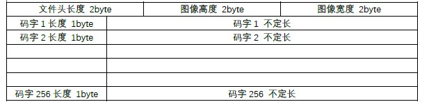
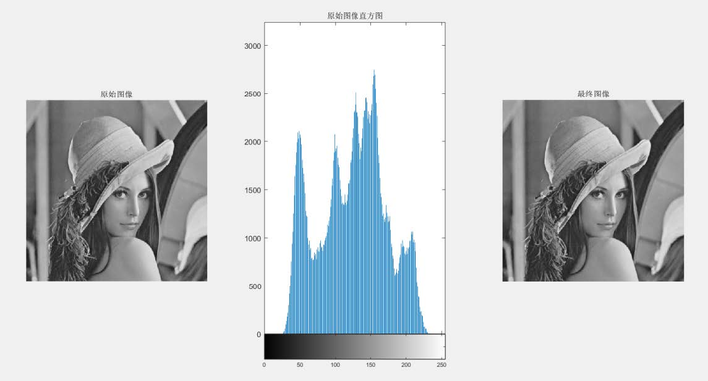
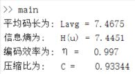
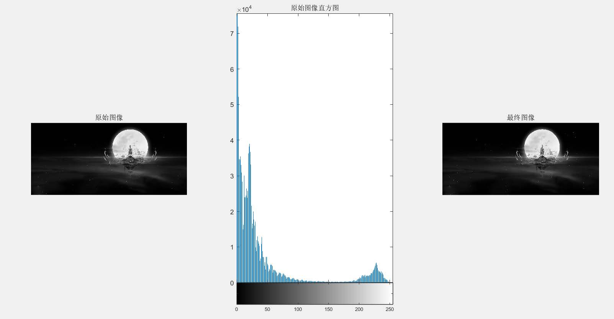
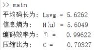

# 项目概要
该项目是数字图像处理课后实验，题目为“**灰度图像赫夫曼编码**”。  
该项目使用软件及版本为`Matlab 2019a`。  
该项目实现了一张图像通过赫夫曼变长编码进行压缩生成比特文件，同样也实现从比特文件解码成为一张图片的功能。

---
# 代码结构
- ### **Huffman_code.m**  
输入：

    Image [m*n (double)]: 目标图像且为黑白图像  
    Filepath (String): 编码文件保存路径  
    
输出：

    Code: 哈夫曼编码的输出结果，为 uint8 的数组  
    Info: 计算得到的编码各指标分析数值结构体  

函数功能： 

    将输入的图像进行哈夫曼变长编码压缩，将编码结果写入路径文件，并返回编码性能分析结果。  

- ### **Huffman_decode.m**  
输入：

    Filepath (String): 编码文件保存路径  
    
输出：

    Image_final [m*n (double)]: 为还原图像且为黑白图像

函数功能： 

    将路径对应文件进行哈夫曼变长解码，还原出图像.

- ### **main.m**  
功能：

    脚本执行文件
    
- ### **自定义头文件**
定义如下：

    首先用16 bit来表示整个文件头的长度，这个信息可以在解码时准确分隔文件头部分和主体部分；
    用两个16 bit来表示图像的分辨率，用于解码时的图像重构；
    其他部分为编码表，编码表的每个码字长度不一， 最极端的情况下，最长码字为255 bit，最短为0 bit，如果为每一个码字分配256 bit即16 byte的空间会有很大程度的浪费。
    所以先使用一个8 bit来表示该变长码字的长度再将等长的码字内容接在其后，然后紧接着是下一个码字的长度和内容，这样可以缩短头文件的长度。
    如图所示：
    

---
# 成果展示
- ### **Lena图像**

- ### **插画图像**

